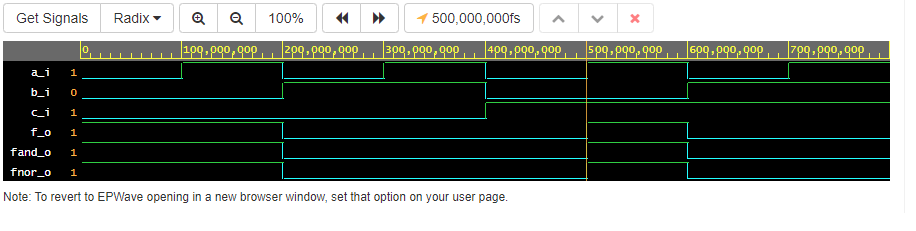
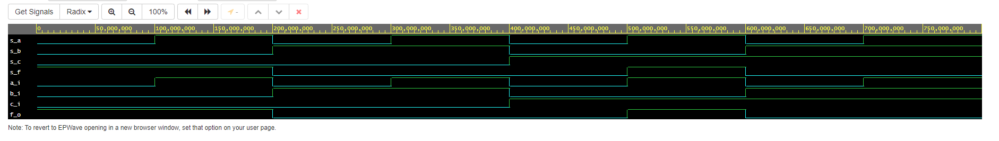

Cp1
01-gates

[odkaz na github](https://github.com/ZborilD/Digital-electronics-1)

[odkaz na play ground](https://www.edaplayground.com/x/NGst)

De Morgan's laws


Distributive laws


| **c** | **b** |**a** | **f(c,b,a)** |
| :-: | :-: | :-: | :-: |
| 0 | 0 | 0 | 1 |
| 0 | 0 | 1 | 1 |
| 0 | 1 | 0 | 0 |
| 0 | 1 | 1 | 0 |
| 1 | 0 | 0 | 0 |
| 1 | 0 | 1 | 1 |
| 1 | 1 | 0 | 0 |
| 1 | 1 | 1 | 0 |

```VHDL
------------------------------------------------------------------------
--
-- Example of basic OR, AND, XOR gates.
-- Nexys A7-50T, Vivado v2020.1, EDA Playground
--
-- Copyright (c) 2019-2020 Tomas Fryza
-- Dept. of Radio Electronics, Brno University of Technology, Czechia
-- This work is licensed under the terms of the MIT license.
--
------------------------------------------------------------------------

library ieee;               -- Standard library
use ieee.std_logic_1164.all;-- Package for data types and logic operations

------------------------------------------------------------------------
-- Entity declaration for basic gates
------------------------------------------------------------------------
entity gates is
    port(
        a_i    : in  std_logic;         -- Data input
        b_i    : in  std_logic;         -- Data input
        c_i    : in  std_logic;         -- Data input
        f_o    : out std_logic;         -- OR output function
        fand_o : out std_logic;         -- AND output function
        fnor_o : out std_logic;         -- NOR output function
        
        fBP1_o : out std_logic;         -- A and not A = 0
        fBP2_o : out std_logic;    	    -- A or not A = 1
        fBP3_o : out std_logic;         -- A or A or A= A
        fBP4_o : out std_logic;         -- A and A and A = A
        
        fDl11_o : out std_logic;        -- Distributive law = fDl12_o
        fDl12_o : out std_logic;        -- Distributive law
        
        fDl21_o : out std_logic;	    -- Distributive law = fDl22_o
        fDl22_o : out std_logic         -- Distributive law
    );
end entity gates;

------------------------------------------------------------------------
-- Architecture body for basic gates
------------------------------------------------------------------------
architecture dataflow of gates is
begin
    f_o  <= ((not b_i) and a_i) or ((not c_i) and (not b_i));
    fand_o <= not ( not ((not b_i) and a_i) and not ((not c_i) and (not b_i)));
    fnor_o <= not(b_i or (not a_i)) or not(c_i or b_i);
    
    fBP1_o <= a_i and (not a_i);
    fBP2_o <= a_i or (not a_i);
    fBP3_o <= a_i or a_i or a_i;
    fBP4_o <= a_i and a_i and a_i;
    
    fDl11_o <= (a_i and b_i) or (a_i and c_i);
    fDl12_o <= a_i and (b_i or c_i);
    
    fDl21_o <= (a_i or b_i) and (a_i or c_i);
    fDl22_o <= a_i or (b_i and c_i);

end architecture dataflow;
