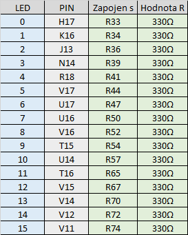
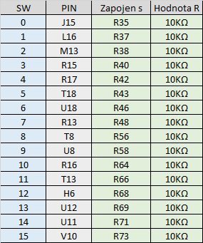
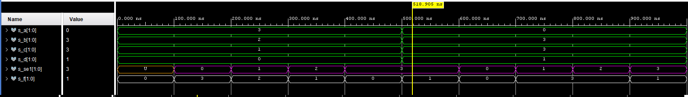

# VIVADO

### Tables of 16 slide switches and 16 LEDs on Nexys A7 board.




### Listing of VHDL architecture from source file:

```VHDL
architecture Behavioral of mux_2bit_4to1 is
begin
    f_o <=  a_i when (se1_i = "00") else
            b_i when (se1_i = "01") else
            c_i when (se1_i = "10") else
            d_i;
end architecture Behavioral;
```

### Listing of VHDL stimulus process from testbench file:

```VHDL
p_stimulus : process
    begin
        -- Report a note at the begining of stimulus process
        report "Stimulus process started" severity note;


        -- First test values
        s_d <= "00"; s_c <= "01"; s_b <= "10"; s_a <= "11"; wait for 100 ns;
        s_se1 <= "00"; wait for 100 ns;
        s_se1 <= "01"; wait for 100 ns;
        s_se1 <= "10"; wait for 100 ns;
        s_se1 <= "11"; wait for 100 ns;
        s_d <= "01"; s_c <= "11"; s_b <= "11"; s_a <= "00"; wait for 100 ns;
        s_se1 <= "00"; wait for 100 ns;
        s_se1 <= "01"; wait for 100 ns;
        s_se1 <= "10"; wait for 100 ns;
        s_se1 <= "11"; wait for 100 ns;
        

        -- Report a note at the end of stimulus process
        report "Stimulus process finished" severity note;
        wait;
        
    end process p_stimulus;
```

### Screenshot with simulated time waveforms:


