# Tutoriál pro prostředí VYVADO (základy)

### Vytvoření nového projektu 
Po otevření programu vivado se zobrazí následující okno.
V tomto oknu lze vytvořit projekt nebo otevřít již vytvořený.
Okno vpravo je seznam nedávno použitých projektů.

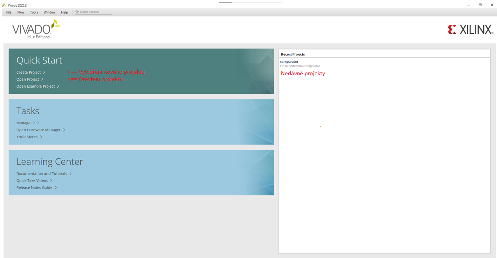

Proklikám se informacemi přes pole “NEXT>” a dostanu se do tohoto okna.
Zde zadám název projektu a jeho umístění 

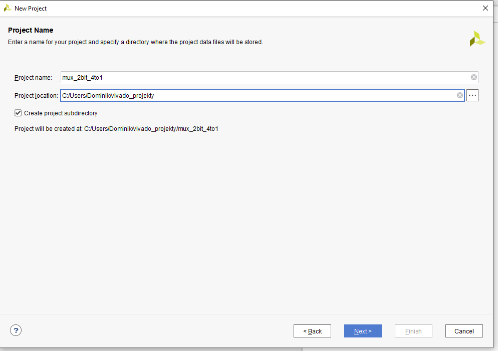

Zde specifikuji typ projektu (prozatím nechat typ RTL)

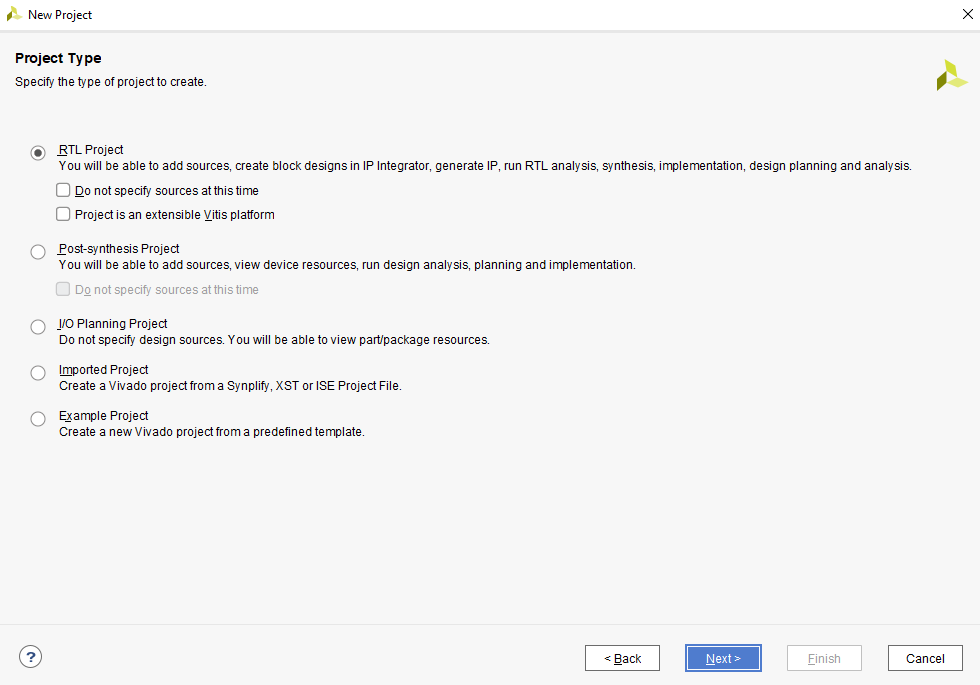

V oknu dále vytvářím/přidávám zdroj a jeho jazyk. (zdroj: specifikace entit, architekturu atd.)

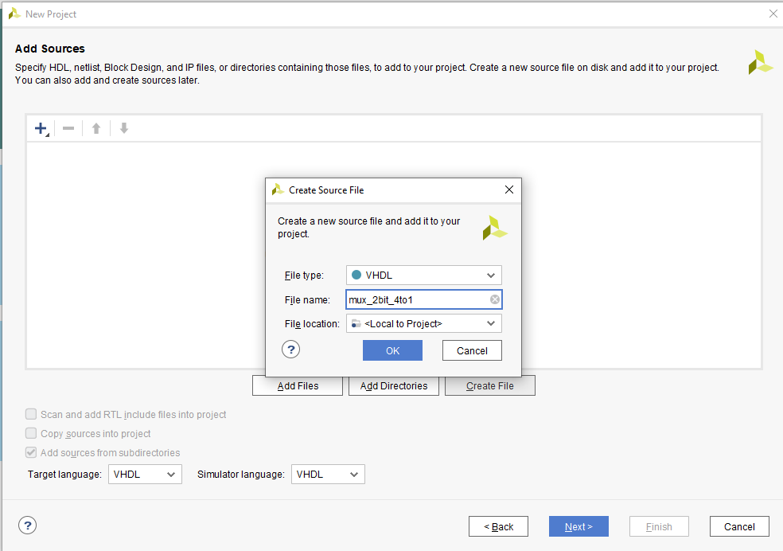

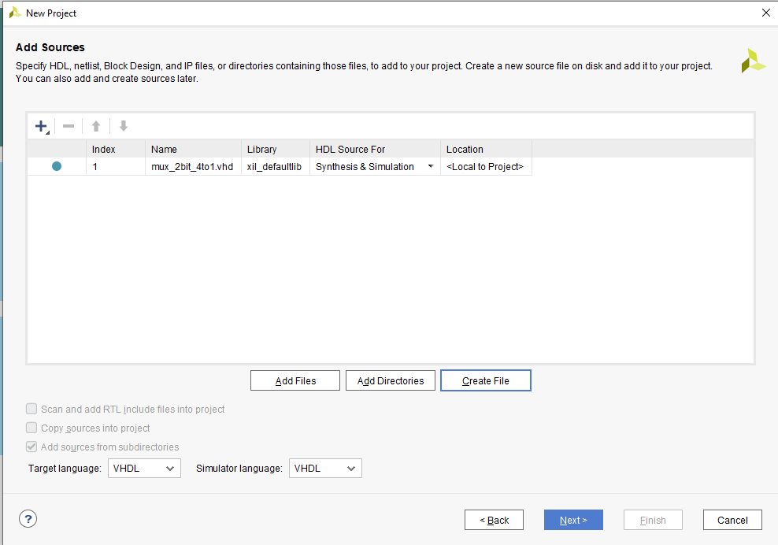

V oknu dále vytvářím/přidávám data k desce. (Piny)

V následujících dvou oknech vybírám součástku nebo celou desku. (Deska už má všechny specifikace, co potřebuji a nemusím se s tím zabývat)

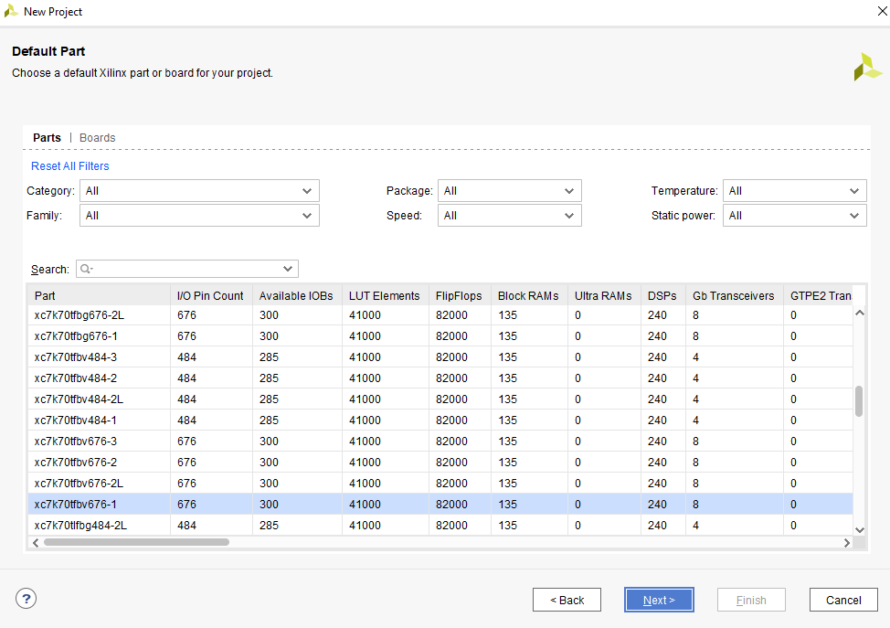

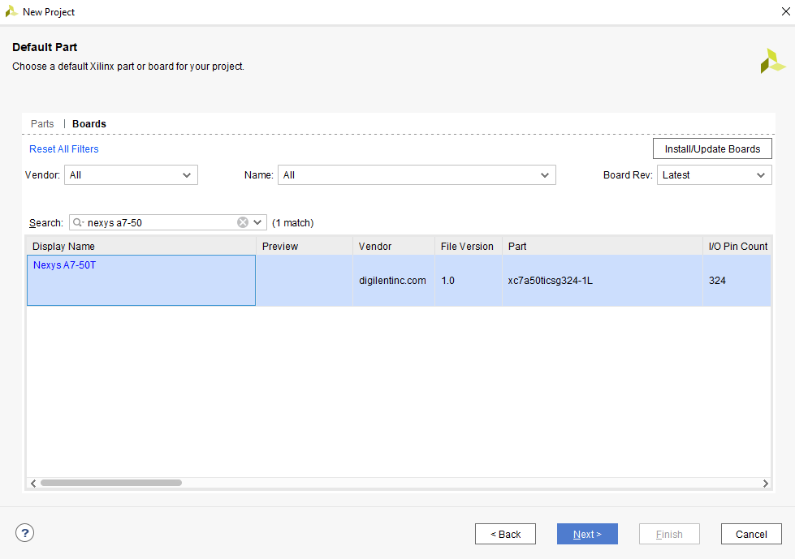

Poslední okno tvorby projektu s rekapitulací.

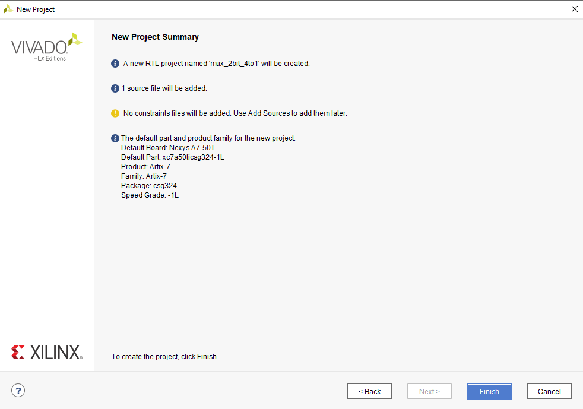

Warning ohledně nastaveni vstupu je spuštěno ihned po načtení (mohu ho „ignorovat“)

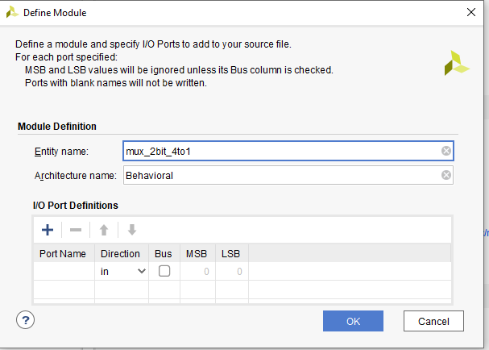

Takto vypadá program, ve kterém budu pracovat.

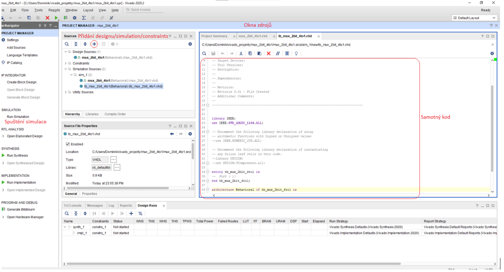

Na následujících obrázcích je postup pro vytvoření zdroje simulace. (testbench)

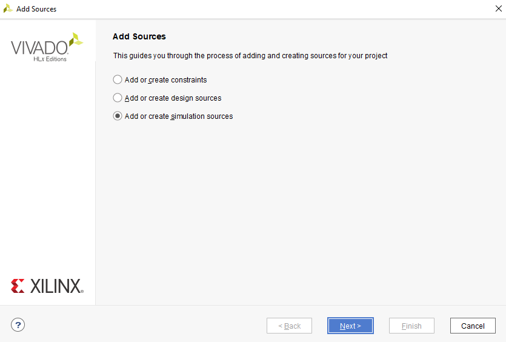

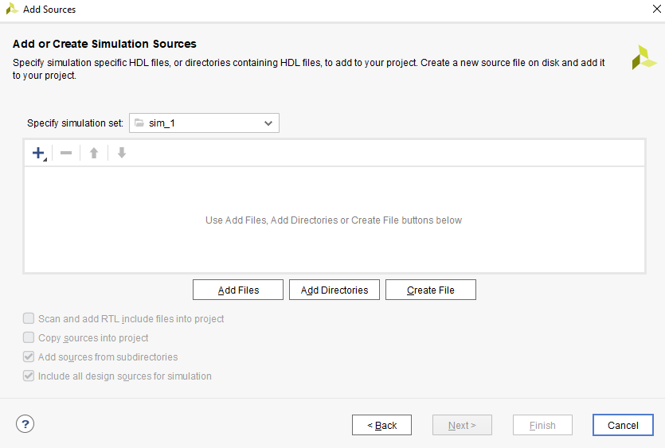

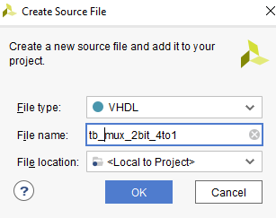

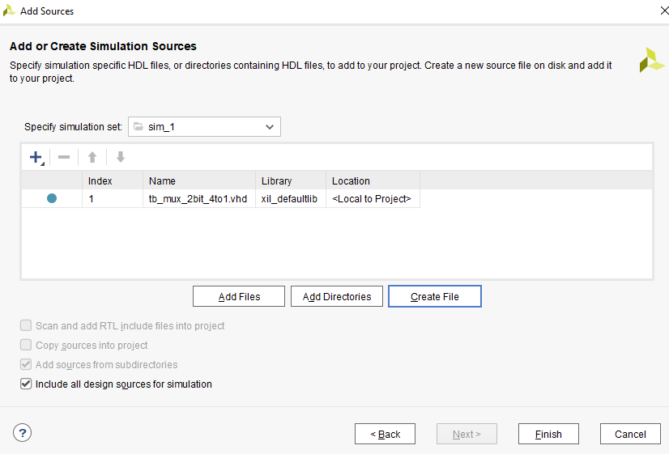

Toto je podokno se simulací.

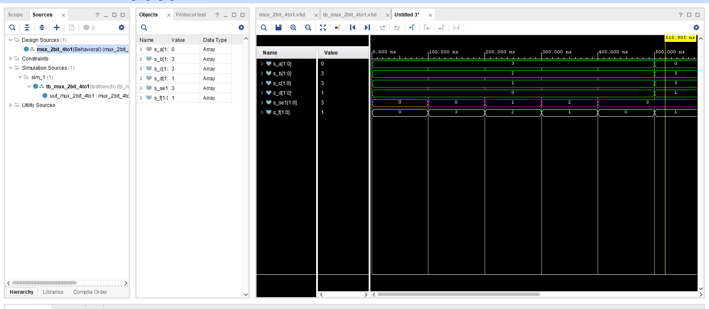

Takto se vytváří nový constraints.

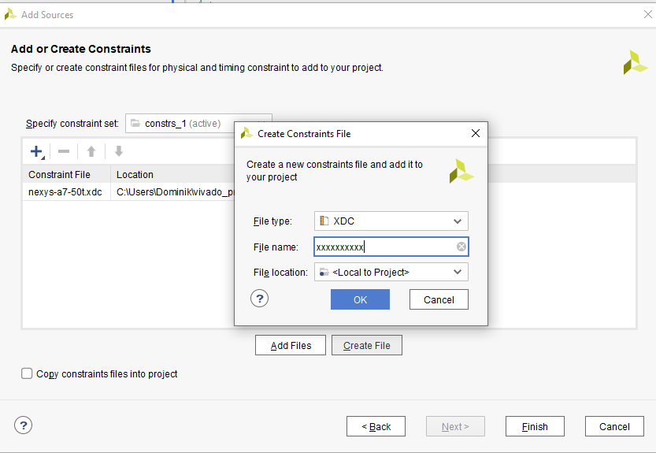

