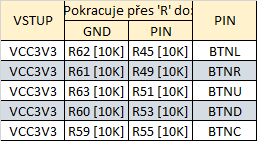
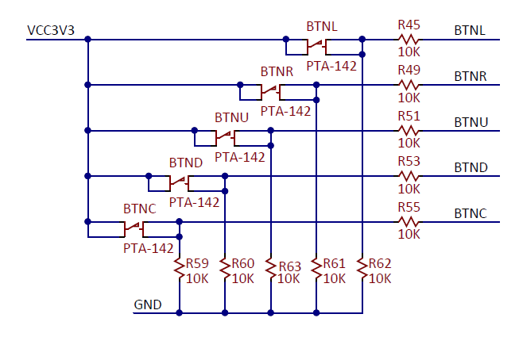
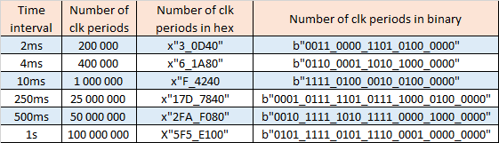
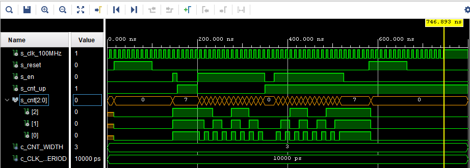
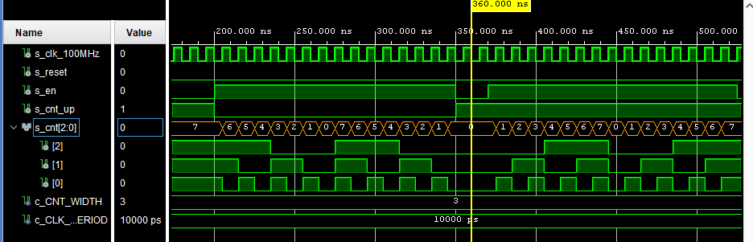

# Lab 5: Binary counter

## 1:
### Figure or table with connection of push buttons on Nexys A7 board.



### Table with calculated values.


## 2:
### Listing of VHDL code of the process p_cnt_up_down.
```VHDL
    p_cnt_up_down : process(clk)
    begin
        if rising_edge(clk) then
        
            if (reset = '1') then               -- Synchronous reset
                s_cnt_local <= (others => '0'); -- Clear all bits

            elsif (en_i = '1') then       -- Test if counter is enabled


                -- TEST COUNTER DIRECTION HERE
                if (cnt_up_i = '1') then --add
                 s_cnt_local <= s_cnt_local + 1;  --pridana mezera     
                                          
                elsif (cnt_up_i = '0') then       --add
                 s_cnt_local <= s_cnt_local - 1;  --add
                
                end if;                  --add

            end if;
        end if;
    end process p_cnt_up_down;
```
### Listing of VHDL reset and stimulus processes from testbench file tb_cnt_up_down.vhd.
```VHDL
  p_clk_gen : process
    begin
        while now < 750 ns loop         -- 75 periods of 100MHz clock
            s_clk_100MHz <= '0';
            wait for c_CLK_100MHZ_PERIOD / 2;
            s_clk_100MHz <= '1';
            wait for c_CLK_100MHZ_PERIOD / 2;
        end loop;
        wait;
    end process p_clk_gen;

    --------------------------------------------------------------------
    -- Reset generation process
    --------------------------------------------------------------------
    p_reset_gen : process
    begin
        s_reset <= '0';                 -- Reset deactivated
        wait for 15 ns;
        s_reset <= '1';                 -- Reset activated
        wait for 85 ns;
        s_reset <= '0';
        wait for 480 ns;
        s_reset <= '1';                 
        wait for 85 ns;
        s_reset <= '0';
        wait;
    end process p_reset_gen;

    --------------------------------------------------------------------
    -- Data generation process
    --------------------------------------------------------------------
    p_stimulus : process
    begin
        report "Stimulus process started" severity note;

        s_en     <= '0';                -- Disable counting
        s_cnt_up <= '0';                
        wait for 145 ns;                  
        s_en     <= '1';                -- Enable counting 
        wait for 10 ns;
        s_en     <= '0'; 
        s_cnt_up <= '1';
        wait for 45 ns;      
        s_en     <= '1';
        s_cnt_up <= '0';
        wait for 150 ns; 
        s_cnt_up <= '1';
        s_en     <= '0';
        wait for 20 ns;
        s_en     <= '1';
        wait for 155 ns;
        s_en     <= '0';
         
        wait;
        report "Stimulus process finished" severity note;
        wait;
    end process p_stimulus;
```
### Screenshot with simulated time waveforms.


## 3:
### Listing of VHDL code from source file top.vhd.
```VHDL
entity top is
    Port ( CLK100MHZ : in STD_LOGIC;
           BTNC : in  STD_LOGIC;
           SW   : in  STD_LOGIC_VECTOR (1-1 downto 0);
           LED  : out STD_LOGIC_VECTOR (4-1 downto 0);
           CA   : out STD_LOGIC;
           CB   : out STD_LOGIC;
           CC   : out STD_LOGIC;
           CD   : out STD_LOGIC;
           CE   : out STD_LOGIC;
           CF   : out STD_LOGIC;
           CG   : out STD_LOGIC;
           AN   : out STD_LOGIC_VECTOR (8-1 downto 0));
end top;

------------------------------------------------------------------------
-- Architecture body for top level
------------------------------------------------------------------------
architecture Behavioral of top is

    -- Internal clock enable
    signal s_en  : std_logic;
    -- Internal counter
    signal s_cnt : std_logic_vector(4 - 1 downto 0);

begin

    --------------------------------------------------------------------
    -- Instance (copy) of clock_enable entity
    clk_en0 : entity work.clock_enable
        generic map(
            --- WRITE YOUR CODE HERE
            g_MAX => 10000000
        )
        port map(
            --- WRITE YOUR CODE HERE
            clk    => CLK100MHZ,
            reset  => BTNC,
            ce_o   => s_en
        );

    --------------------------------------------------------------------
    -- Instance (copy) of cnt_up_down entity
    bin_cnt0 : entity work.cnt_up_down
        generic map(
            --- WRITE YOUR CODE HERE
            g_CNT_WIDTH => 4
        )
        port map(
            --- WRITE YOUR CODE HERE
            clk      => CLK100MHZ,
            reset    => BTNC,
            en_i     => s_en,
            cnt_up_i => SW(0),
            cnt_o    => s_cnt
        );

    -- Display input value on LEDs
    LED(3 downto 0) <= s_cnt;

    --------------------------------------------------------------------
    -- Instance (copy) of hex_7seg entity
    hex2seg : entity work.hex_7seg
        port map(
            hex_i    => s_cnt,
            seg_o(6) => CA,
            seg_o(5) => CB,
            seg_o(4) => CC,
            seg_o(3) => CD,
            seg_o(2) => CE,
            seg_o(1) => CF,
            seg_o(0) => CG
        );

    -- Connect one common anode to 3.3V
    AN <= b"1111_1110";

end architecture Behavioral;
```
