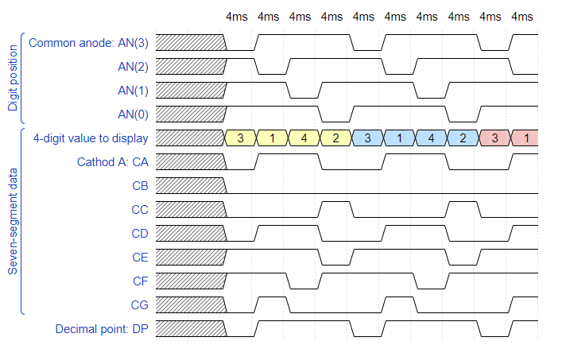
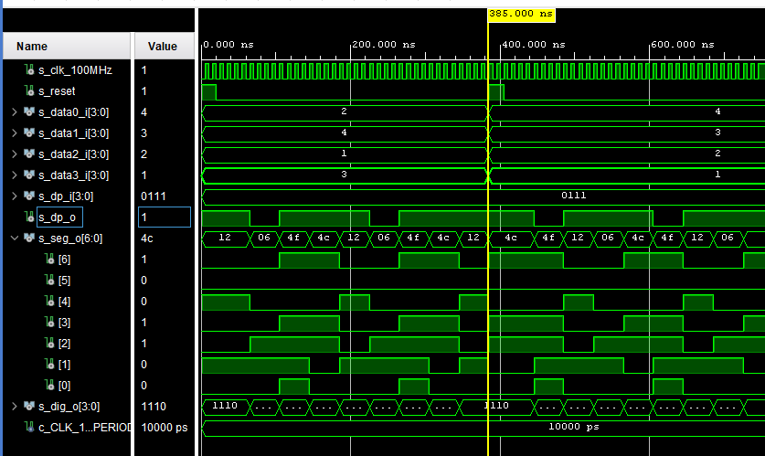

# Lab 6: Display_driver

## 1: Preparation tasks.
### Timing diagram figure for displaying value 3.142. 



## 2: Display driver.
### Listing of VHDL code of the process p_mux.
```VHDL
 p_mux : process(s_cnt, data0_i, data1_i, data2_i, data3_i, dp_i)
    begin
        case s_cnt is
            when "11" =>
                s_hex <= data3_i;
                dp_o  <= dp_i(3);
                dig_o <= "0111";    

            when "10" =>
                -- WRITE YOUR CODE HERE
                s_hex <= data2_i;
                dp_o  <= dp_i(2);
                dig_o <= "1011";

            when "01" =>
                -- WRITE YOUR CODE HERE
                s_hex <= data1_i;
                dp_o  <= dp_i(1);
                dig_o <= "1101";

            when others =>
                -- WRITE YOUR CODE HERE
                s_hex <= data0_i;
                dp_o  <= dp_i(0);
                dig_o <= "1110";
                
        end case;
    end process p_mux;
```

### Listing of VHDL testbench file tb_driver_7seg_4digits.
```VHDL
architecture testbench of tb_driver_7seg_4digits is

    -- Local constants
    constant c_CLK_100MHZ_PERIOD : time    := 10 ns;
    
    --Local signals
    signal s_clk_100MHz : std_logic;
    
    --- WRITE YOUR CODE HERE
    signal clk            : std_logic;
    signal s_reset        : std_logic;
    --Data(0-3)  
    signal s_data0_i      : std_logic_vector(4 - 1 downto 0);
    signal s_data1_i      : std_logic_vector(4 - 1 downto 0);
    signal s_data2_i      : std_logic_vector(4 - 1 downto 0);
    signal s_data3_i      : std_logic_vector(4 - 1 downto 0);
    signal s_dp_i         : std_logic_vector(4 - 1 downto 0);
    --Other signals 
    signal s_dp_o         : std_logic;
    signal s_seg_o        : std_logic_vector(7 - 1 downto 0);  
    signal s_dig_o        : std_logic_vector(4 - 1 downto 0);
    
begin
    -- Connecting testbench signals with driver_7seg_4digits entity
    -- (Unit Under Test)
    --- WRITE YOUR CODE HERE
    uut_ce : entity work.driver_7seg_4digits
         port map(
            clk     => s_clk_100MHz,            
            reset   => s_reset,     
            --Data(0-3)                   
            data0_i => s_data0_i,
            data1_i => s_data1_i,  
            data2_i => s_data2_i,  
            data3_i => s_data3_i,           
            --Other signals                   
            dp_i    => s_dp_i,    
            dp_o    => s_dp_o,
            seg_o   => s_seg_o,   
            dig_o   => s_dig_o   

        );

    --------------------------------------------------------------------
    -- Clock generation process
    --------------------------------------------------------------------
    p_clk_gen : process
    begin
        while now < 750 ns loop         -- 75 periods of 100MHz clock
            s_clk_100MHz <= '0';
            wait for c_CLK_100MHZ_PERIOD / 2;
            s_clk_100MHz <= '1';
            wait for c_CLK_100MHZ_PERIOD / 2;
        end loop;
        wait;
    end process p_clk_gen;

    --------------------------------------------------------------------
    -- Reset generation process
    --------------------------------------------------------------------
    --- WRITE YOUR CODE HERE
    p_reset_gen : process
    begin
        -- Reset activated
        s_reset <= '1';
        wait for 20 ns;
        -- Reset deactivated
        s_reset <= '0';
        wait for 365 ns;
        s_reset <= '1';
        wait for 20 ns;
        s_reset <= '0';
        wait;
    end process p_reset_gen;

    --------------------------------------------------------------------
    -- Data generation process
    --------------------------------------------------------------------
    --- WRITE YOUR CODE HERE
    p_stimulus : process
    begin
        report "Stimulus process started" severity note;
    
        s_data0_i <= "0010";
        s_data1_i <= "0100";
        s_data2_i <= "0001";
        s_data3_i <= "0011";
        s_dp_i    <= "0111";       
        wait for 385 ns;
        
        s_data0_i <= "0100";
        s_data1_i <= "0011";
        s_data2_i <= "0010";
        s_data3_i <= "0001";
        s_dp_i    <= "0111";       
        
        
        wait;
        report "Stimulus process finished" severity note;
        wait;
    end process p_stimulus;

end architecture testbench;
```
### Screenshot with simulated time waveforms.


### Listing of VHDL architecture of the top layer.
```VHDL
------------------------------------------------------------------------
-- Architecture body for top level
------------------------------------------------------------------------
architecture Behavioral of top is
    -- No internal signals
begin

    --------------------------------------------------------------------
    -- Instance (copy) of driver_7seg_4digits entity
    driver_seg_4 : entity work.driver_7seg_4digits
        port map(
            clk        => CLK100MHZ,
            reset      => BTNC,
            data0_i(3) => SW(3),
            data0_i(2) => SW(2),
            data0_i(1) => SW(1),
            data0_i(0) => SW(0),
            --- WRITE YOUR CODE HERE
              
            data1_i(7) => SW(7),
            data1_i(6) => SW(6),
            data1_i(5) => SW(5),
            data1_i(4) => SW(4),
            
            data2_i(11) => SW(11),
            data2_i(10) => SW(10),
            data2_i(9) => SW(9),
            data2_i(8) => SW(8),
            
            data3_i(15) => SW(15),
            data3_i(14) => SW(14),
            data3_i(13) => SW(13),
            data3_i(12) => SW(12),
            
            dig_o => AN(4-1 downto 0),
            
            seg_o(0) => CA,
            seg_o(1) => CB,
            seg_o(2) => CC,
            seg_o(3) => CD,
            seg_o(4) => CE,
            seg_o(5) => CF,
            seg_o(6) => CG,
            
            dp_i => "0111",
            dp_o => DP
        );

    -- Disconnect the top four digits of the 7-segment display
    AN(7 downto 4) <= b"1111";

end architecture Behavioral;

```
