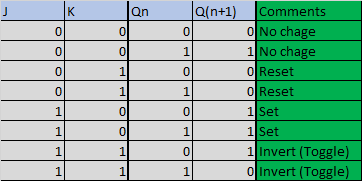
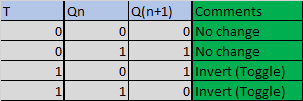
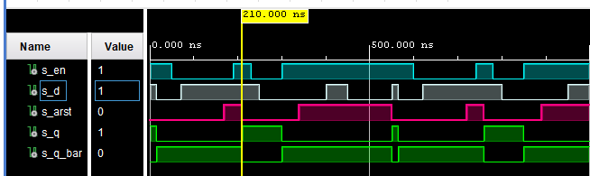
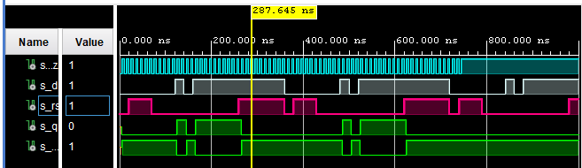
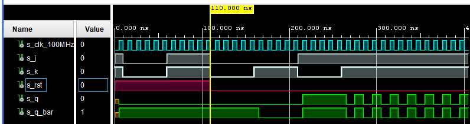
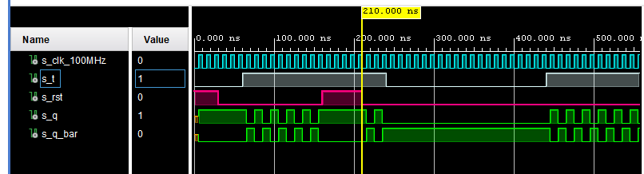

# Lab 7: Latches and Flip-flops

## 1) Preparation tasks:





## 2) D latch:
###  VHDL code listing of the process p_d_latch.
```VHDL
 p_d_latch : process(en, d, arst)
    begin
        if (arst = '1') then
            q     <= '0';
            q_bar <= '1';
        elsif (en = '1') then
            q     <= d;
            q_bar <= not d;        
        end if;
    end process p_d_latch;
```

### Listing of VHDL reset and stimulus processes from the testbench tb_d_latch.vhd.
```VHDL
p_stimulus : process
    begin
        report "Stimulus process started" severity note;
        
        s_en   <= '1';
        s_d    <= '1';
        s_arst <= '0';
        wait for 15 ns;
        s_d    <= '0';
        wait for 35 ns;
        s_en   <= '0';
        wait for 20 ns;
        s_d    <= '1';
        wait for 100 ns;
        s_arst <= '1';
        wait for 20 ns;
        s_en   <= '1';
        wait for 20 ns;
        s_arst <= '0';
        wait for 20 ns;
        s_en   <= '0';
        wait for 20 ns;
        s_d    <= '0';
        wait for 50 ns;
        s_en   <= '1';
        wait for 40 ns;
        s_arst <= '1';
        wait for 60 ns;
        s_d    <= '1';
        wait for 50 ns;
        s_d    <= '0';
        wait for 50 ns;
        s_arst <= '1';
        wait for 50 ns;
        
        report "Stimulus process finished" severity note;
    end process p_stimulus;
```

### Screenshot with simulated time waveforms.



## 3) Flip-flops:
###  VHDL code listing of the processes p_d_ff_arst.
```VHDL
p_d_ff_arst : process (clk, d, arst)
    begin
        if (arst = '1') then
            q     <= '0';
            q_bar <= '1';
        elsif rising_edge(clk) then
            q     <= d;
            q_bar <= not d;        
        end if;
    end process p_d_ff_arst;
```
### Listing of VHDL clock, reset and stimulus processes
```VHDL
p_clk_gen : process
    begin
        while now < 750 ns loop         -- 75 periods of 100MHz clock
            s_clk_100MHz <= '0';
            wait for c_CLK_100MHZ_PERIOD / 2;
            s_clk_100MHz <= '1';
            wait for c_CLK_100MHZ_PERIOD / 2;
        end loop;
        wait;
    end process p_clk_gen;
    
    p_stimulus : process
    begin
        report "Stimulus process started" severity note;
              
        s_d       <= '1';
        s_arst    <= '1';
        wait for 20 ns;
        s_d       <= '0';
        s_arst    <= '0';
        wait for 50 ns;
        s_d       <= '1';
        wait for 50ns;
        s_d    <= '0';
        wait for 50ns;
        s_arst    <= '1';
        wait for 50ns;
        s_arst    <= '0';
 
        report "Stimulus process finished" severity note;
    end process p_stimulus;
```


### VHDL code listing of the processes p_d_ff_rst.
```VHDL
 p_d_ff_rst : process (clk)
    begin
        if rising_edge(clk) then
            if (rst = '1') then
                q     <= '0';
                q_bar <= '1';
            else
                q     <= d;
                q_bar <= not d;
            end if;     
        end if;
    end process p_d_ff_rst;
```
### Listing of VHDL clock, reset and stimulus processes
```VHDL
p_clk_gen : process
    begin
        while now < 750 ns loop         -- 75 periods of 100MHz clock
            s_clk_100MHz <= '0';
            wait for c_CLK_100MHZ_PERIOD / 2;
            s_clk_100MHz <= '1';
            wait for c_CLK_100MHZ_PERIOD / 2;
        end loop;
        wait;
    end process p_clk_gen;
    
    p_stimulus : process
    begin
        report "Stimulus process started" severity note;
        
        s_rst <= '1';
        s_t   <= '0';
        wait for 30 ns;
        s_rst <= '0';
        wait for 30 ns;
        s_t   <= '1';
        wait for 100 ns;
        s_rst <= '1';
        wait for 50 ns;
        s_rst <= '0';
        wait for 30ns;
        s_t   <= '0';
        wait for 200ns;
        s_t   <= '1';
        wait for 100 ns;
        wait; 
        
        report "Stimulus process finished" severity note;
    end process p_stimulus;
```

### Screenshot with simulated time waveforms.


### VHDL code listing of the processes p_jk_ff_rst.
```VHDL
 p_jk_ff_rst : process (clk)
    begin
        if rising_edge(clk) then
            if (rst = '1') then
                s_q     <= '0';
                s_q_bar <= '1';   
            else
                if (j = '0' and k = '0') then
                    s_q       <= s_q;
                    s_q_bar   <= s_q_bar;
                elsif (j = '0' and k = '1') then
                    s_q       <= '0';
                    s_q_bar   <= '0';    
                elsif (j = '1' and k = '0') then
                    s_q       <= '1';
                    s_q_bar   <= '1';      
                else  --j = '1', k = '1'
                    s_q       <= not s_q;
                    s_q_bar   <= not s_q_bar;
                end if; 
            end if;
        end if;
    end process p_jk_ff_rst;
```
### Listing of VHDL clock, reset and stimulus processes
```VHDL
p_clk_gen : process
    begin
        while now < 750 ns loop         -- 75 periods of 100MHz clock
            s_clk_100MHz <= '0';
            wait for c_CLK_100MHZ_PERIOD / 2;
            s_clk_100MHz <= '1';
            wait for c_CLK_100MHZ_PERIOD / 2;
        end loop;
        wait;
    end process p_clk_gen;
    
    p_stimulus : process
    begin
        report "Stimulus process started" severity note;
        
        s_rst   <= '1';
        s_j     <= '1';
        s_k     <= '1';
        wait for 10 ns;
        s_j     <= '0';
        s_k     <= '0';
        wait for 50 ns;
        s_j     <= '1';
        s_k     <= '1';
        wait for 50 ns;
        s_rst   <= '0';
        s_j     <= '0';
        s_k     <= '0';
        wait for 50 ns;
        s_j     <= '0';
        s_k     <= '1';
        wait for 50 ns;
        s_j     <= '1';
        s_k     <= '0';
        wait for 50 ns;
        s_j     <= '1';
        s_k     <= '1';      
        wait;  

        report "Stimulus process finished" severity note;
    end process p_stimulus;
```
### Screenshot with simulated time waveforms.


### VHDL code listing of the processes p_t_ff_rst.
```VHDL
architecture Behavioral of t_ff_rst is
    signal s_q     : STD_LOGIC;
    signal s_q_bar : STD_LOGIC;
begin
    p_t_ff_rst : process (clk)
    begin
        if rising_edge(clk) then
            if (rst = '1') then
                s_q     <= '1';
                s_q_bar <= '0';   
            else
                if (t = '0') then
                    s_q     <= s_q;
                    s_q_bar <= s_q_bar; 
                else
                    s_q     <= not s_q;
                    s_q_bar <= not s_q_bar; 
                end if;
            end if;
        end if;
    end process p_t_ff_rst;

    q     <= s_q;
    q_bar <= s_q_bar;
end Behavioral;
```
### Listing of VHDL clock, reset and stimulus processes
```VHDL
p_clk_gen : process
    begin
        while now < 750 ns loop         -- 75 periods of 100MHz clock
            s_clk_100MHz <= '0';
            wait for c_CLK_100MHZ_PERIOD / 2;
            s_clk_100MHz <= '1';
            wait for c_CLK_100MHZ_PERIOD / 2;
        end loop;
        wait;
    end process p_clk_gen;
    
    p_stimulus : process
    begin
        report "Stimulus process started" severity note;
        
        s_rst <= '1';
        s_t   <= '0';
        wait for 30 ns;
        s_rst <= '0';
        wait for 30 ns;
        s_t   <= '1';
        wait for 100 ns;
        s_rst <= '1';
        wait for 50 ns;
        s_rst <= '0';
        wait for 30ns;
        s_t   <= '0';
        wait for 200ns;
        s_t   <= '1';
        wait for 100 ns;
        wait;

        report "Stimulus process finished" severity note;
    end process p_stimulus;
```

### Screenshot with simulated time waveforms.



