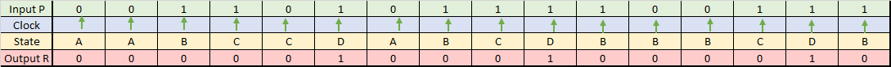

# Lab 8: Traffic light controller.

## 1) Preparation tasks:
### State table.



### Figure.


## 2) Traffic light controller.
### State diagram.


### Listing of VHDL code of sequential process p_traffic_fsm.
```VHDL
p_traffic_fsm : process(clk)
    begin
        if rising_edge(clk) then
            if (reset = '1') then       -- Synchronous reset
                s_state <= STOP1 ;      -- Set initial state
                s_cnt   <= c_ZERO;      -- Clear all bits

            elsif (s_en = '1') then
                -- Every 250 ms, CASE checks the value of the s_state 
                -- variable and changes to the next state according 
                -- to the delay value.
                case s_state is

                    -- If the current state is STOP1, then wait 1 sec
                    -- and move to the next GO_WAIT state.
                    when STOP1 =>
                        -- Count up to c_DELAY_1SEC
                        if (s_cnt < c_DELAY_1SEC) then
                            s_cnt <= s_cnt + 1;
                        else
                            -- Move to the next state
                            s_state <= WEST_GO;
                            -- Reset local counter value
                            s_cnt   <= c_ZERO;
                        end if;

                    when WEST_GO =>
                        -- WRITE YOUR CODE HERE
                        -- Count up to c_DELAY_GO
                        if (s_cnt < c_DELAY_GO) then
                            s_cnt <= s_cnt + 1;
                        else
                            -- Move to the next state
                            s_state <= WEST_WAIT;
                            -- Reset local counter value
                            s_cnt   <= c_ZERO;
                        end if;
                        
                    when WEST_WAIT =>
                        -- WRITE YOUR CODE HERE
                        -- Count up to c_DELAY_WAIT
                        if (s_cnt < c_DELAY_WAIT) then
                            s_cnt <= s_cnt + 1;
                        else
                            -- Move to the next state
                            s_state <= STOP2;
                            -- Reset local counter value
                            s_cnt   <= c_ZERO;
                        end if;
                        
                    when STOP2 =>
                        -- WRITE YOUR CODE HERE
                        -- Count up to c_DELAY_1SEC
                        if (s_cnt < c_DELAY_1SEC) then
                            s_cnt <= s_cnt + 1;
                        else
                            -- Move to the next state
                            s_state <= SOUTH_GO;
                            -- Reset local counter value
                            s_cnt   <= c_ZERO;
                        end if;
                        
                    when SOUTH_GO =>
                        -- WRITE YOUR CODE HERE
                        -- Count up to c_DELAY_GO
                        if (s_cnt < c_DELAY_GO) then
                            s_cnt <= s_cnt + 1;
                        else
                            -- Move to the next state
                            s_state <= SOUTH_WAIT;
                            -- Reset local counter value
                            s_cnt   <= c_ZERO;
                        end if;
                        
                    when SOUTH_WAIT =>
                        -- WRITE YOUR CODE HERE
                        -- Count up to c_DELAY_WAIT
                        if (s_cnt < c_DELAY_WAIT) then
                            s_cnt <= s_cnt + 1;
                        else
                            -- Move to the next state
                            s_state <= STOP1;
                            -- Reset local counter value
                            s_cnt   <= c_ZERO;
                        end if;                   

                    -- It is a good programming practice to use the 
                    -- OTHERS clause, even if all CASE choices have 
                    -- been made. 
                    when others =>
                        s_state <= STOP1;

                end case;
            end if; -- Synchronous reset
        end if; -- Rising edge
    end process p_traffic_fsm;
```

### Listing of VHDL code of combinatorial process p_output_fsm.
```VHDL
p_output_fsm : process(s_state)
    begin
        case s_state is
            when STOP1 =>
                south_o <= "100";   -- Red (RGB = 100)
                west_o  <= "100";   -- Red (RGB = 100)
                -- WRITE YOUR CODE HERE
            when WEST_GO =>
                south_o <= "100";   -- Red
                west_o  <= "010";   -- Green
            when WEST_WAIT =>
                south_o <= "100";   -- Red
                west_o  <= "110";   -- Yellow
            when STOP2 =>
                south_o <= "100";   -- Red
                west_o  <= "100";   -- Red
            when SOUTH_GO =>
                south_o <= "010";   -- Green
                west_o  <= "100";   -- Red
            when SOUTH_WAIT =>
                south_o <= "110";   -- Yellow
                west_o  <= "100";   -- Red
                -- WRITE YOUR CODE HERE
            when others =>
                south_o <= "100";   -- Red
                west_o  <= "100";   -- Red
        end case;
    end process p_output_fsm;

end architecture Behavioral;
```

### Screenshots of the simulation.


